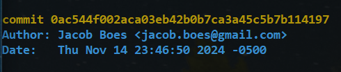
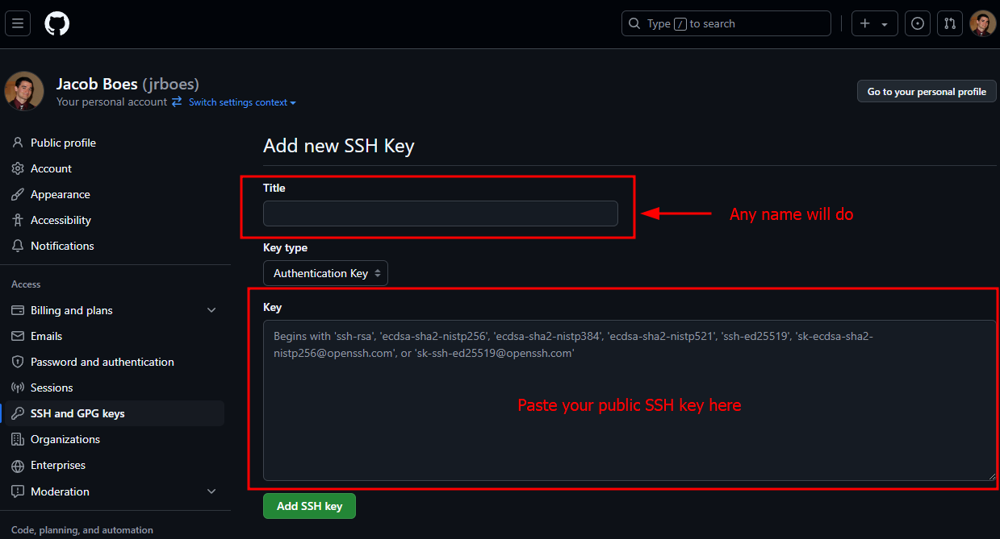
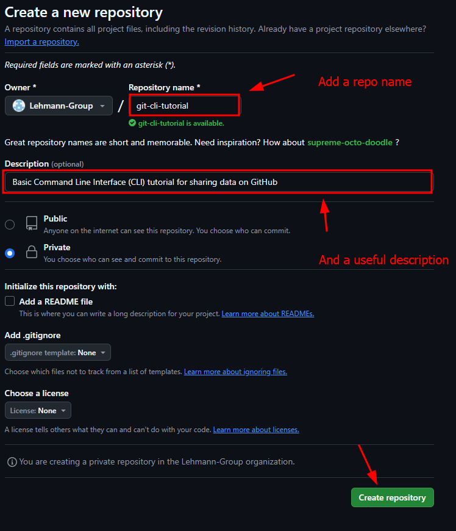
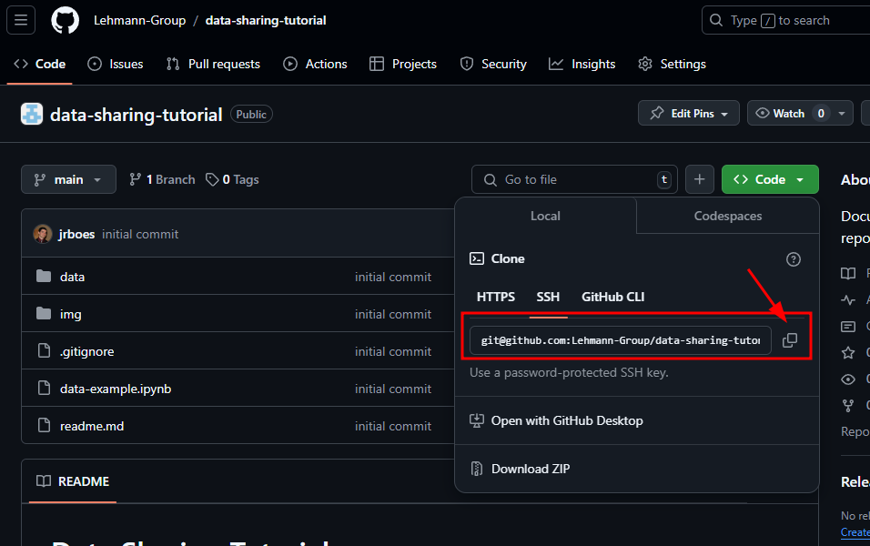

# Basic Git Tutorial

For those who don't yet have a GitHub account, go to [Github](https://github.com) and click on Sign in/ Sign up in the upper right-hand corner. For account creation, follow the instructions provided.

## About Git
[Git](https://git-scm.com) is an open source version control software created in 2005 by [Linus Torvald](https://en.wikipedia.org/wiki/Linus_Torvalds), the creator of the Linux operating system. Since then, it has become widely used amongst software developers due to its ability to keep track of changes and efficiently trace changes between versions of those changes, called *commits*. It can be run inside a local directory on your

## Installing Git
### Windows
Part of the goal of this tutorial is to give novice computer users some familiarity with the command line. In Windows, this can take two forms on Windows.

#### For Advanced users:
For a more integrated experience, I use a package management tool called [Chocolatey](https://chocolatey.org), which allows for the management of a broad selection of packaged from the Windows PowerShell. It can be [installed](https://chocolatey.org/install) by opening the Windows PowerShell in Admin mode and entering the following command:

```
Set-ExecutionPolicy Bypass -Scope Process -Force; [System.Net.ServicePointManager]::SecurityProtocol = [System.Net.ServicePointManager]::SecurityProtocol -bor 3072; iex ((New-Object System.Net.WebClient).DownloadString('https://community.chocolatey.org/install.ps1'))
```

This might take a few minutes.

Be aware, this method can cause problems with the SSH key generation/use step if Git for Windows (below) is installed. [See here](https://gist.github.com/danieldogeanu/16c61e9b80345c5837b9e5045a701c99).

#### For Beginner users:
Download [Git for Windows](https://github.com/git-for-windows/git/releases/download/v2.47.0.windows.2/Git-2.47.0.2-64-bit.exe) from the Git home page.

Run the executable and follow the instructions.

While Git for Windows looks similar to a command line, it is only useful for git commands. This can make usage frustrating for more advanced users may mistake it for their full command line tool, such as above.

### Mac
There are several ways to accomplish this, but part of the goal of this tutorial is to make novice users comfortable with package manager softwares in the command line. So, we will be using the homebrew package manager.

Open the command line (Cmd + Space, then type "terminal.exe" in the spotlight search and run). Then, we can [install homebrew](https://brew.sh) with the following command:

```bash
/bin/bash -c "$(curl -fsSL https://raw.githubusercontent.com/Homebrew/install/HEAD/install.sh)"
```

This command may prompt you for your computers' password. Installing homebrew can take a few minutes.

Once homebrew has completed its installation, the terminal will become available for new commands again. Now we install the git package with the following command:

```bash
brew install git
```

### Linux
Open the command line (Ctrl + Alt + T) and type the following command:

```bash
sudo apt install git
```

This command may prompt you for your computers' password.

### Post-Installation

If this is your first time using git, you'll also be prompted to input a username and email. For me, this would look as follows:

```bash
git config --global user.name "Jacob Boes"
git config --global user.email "jacobboes@gmail.com"
```

## Basic Git usage in the Command Line Interface (CLI)

In this section, we're going to cover some basic usage of a *local* Git repository.

First, with the Command Line Interface (CLI) open, let's navigate to our desktop with the following command:

```bash
cd ~/Desktop
```

Here, `cd` stands for "change directory," `~` is a shortcut for the home directory in our computers' file structure, and it follows the `Desktop` folder.

Now, we can create a folder for our git repo:

```bash
mkdir temp
```

`mkdir` will create a directory named temp in our desktop folder. You may see this pop into existence on your desktop if there isn't a window covering it. You can remove it later. For those not familiar with CLI, we can see from this basic usage that we can navigate the computers' folder structure in an alternative fashion from using the file explorer. 

This can be helpful for more rapid navigation, though it takes some getting used to. However, if you find it easier, or need an learning assist, you can open this file in the file explorer and keep an eye on the files as things change.

Now, let's move into our new directory:

```bash
cd temp
```

Now we are ready to demonstrate some basic Git usage:

#### 1. Git init

First, we'll start by initiating our first Git repo:

```bash
git init
```

This will create a hidden directory called `.git` which will store all of the version control meta-data. We can view it from the CLI with the following command:

```bash
ls -h
```

Here, `-h` is an argument for the `ls` command, which specifically shows the hidden files.

#### 2. Git add & the .gitignore file

Currently, our repo doesn't contain anything, so there's nothing to version control. Let's make a few files quickly:

```bash
echo 'Hello' > readme.md
mkdir data
echo 'This file is garbage' > data/trash.log
```

Now, we can use the `ls` command as shown above that we have two new files, one markdown file and one text file. We can also see these new files using git's status command:

```bash
git status
```

Before we track these files, let's assume that the data folder holds files too large for version control, so we want to ignore them from version tracking. We can do this in a more permeant fashion by adding a `.gitignore` file:

```bash
echo 'data/' > .gitignore
```

Now, when we use the status command, the data file should be missing. We can do this with files and wildcards as well. You can find more details [here](https://git-scm.com/docs/gitignore).


Now let's add the README for version tracking:

```bash
git add .gitignore
```

This will selectively add the `.gitignore` file. We can check this with the status command. If we want to add all of our changes, we can use the following:

```bash
git add -A
```

#### 3. Git commit

Now that we've added the files we want tracked, we can create a *commit*.

```bash
git commit -m 'This is a short message to help me identify this commit later'
```

A commit represents a snapshot in time of our code. It can be important to create commits strategically as each represents a stored version of your repository which can be recalled by git on command. As a rule of thumb for research purposes, check your codes' functionality regularly and make a checkout after each successful execution point.

We can see all such stored versions by calling the log command:

```bash
git log
```

#### 4. Git checkout

Now, we can figure out how to access a commit once we have more than one. First, let's add something to our README file:

```bash
echo 'my name is Jake' >> readme.md
```

We can combine steps 2 and 3 for simple changes with the `-a` argument which will add all changes.

```bash
git commit -am 'Added my name to readme'
```

Now we can check our commit with the in the logs.

```bash
git log
```

If we want to recover a previous version of our repository, we can easily accomplish this with the checkout command. We can accomplish this in two separate ways. The first is to checkout a commit in reference to the "HEAD" state, which is shorthand for the commit we are currently looking at.

```bash
git checkout HEAD^1
```

This will checkout the commit 1 record above the current commit. Alternatively, we can checkout to a specific commit using the commit's unique ID shown in the log. For example, if the log command looks like the below, we would use the following command.



```bash
git checkout 0ac544
```

Note: we don't need the full key (`0ac544f002aca03eb42b0b7ca3a45c5b7b114197`), only enough to identify it as unique from all other commits in the repo.

Once we've chosen our method and checked out our commit, the entire directory will have been reverted to our earlier version of the code. We're free to make different changes from this point.

```bash
echo 'my name is Bob' >> readme.md
git commit -am 'Added my alias to readme'
```

#### 5. Git branch

Great, we've checked out a previous commit and begun a new series of changes, but this is where things start getting a bit complex. It turns out, Git is still tracking our changes from before we made our checkout. The series of commits we made before we made our checkout is called a *branch*. When we shifted the *HEAD* of our branch (referenced above) to a previous commit, the *HEAD* became detached from the *branch*. Before we do anything else, we need to reattach the *HEAD*, i.e. our current version, to a new *branch*.

```bash
git branch main
```

This will attach the HEAD to a branch named "main." Now, we've saved our new progression of commits, and we're free to move to our old branch without losing anything. We do this with the checkout command.

```bash
git checkout master
```

Here, "master" is the default name of the first branch created when we use the init command. We are now free to develop two separate versions of our code within the same directory. This can be convenient when needing two separate deployments of a software, e.g. one execution on a personal computer, and one for execution in a server environment.

#### 6. Other useful commands

##### `git diff`

The diff command is useful for showing the changes made between two versions of code. Here's a few examples:

```bash
git diff HEAD^1
```

Gets the difference between the HEAD and the previous commit. We can also use the unique ID of a specific commit, similar to the checkout command above.

```bash
git diff master main
```

Gets the difference between the HEAD of the "master" and "main" branch. We can also reference previous commits of a branch using the `^` syntax.

```bash
git diff master main^1
```

Gets the difference between the HEAD of the "master" and 1 commit above the HEAD of the "main" branch.

##### `git stash`

Some of the above changes, like checkout and branch, will only work if the repo is in a "clean" state. That means there are no untracked files that haven't been committed yet. That's useful for making sure we don't lose any of our work, but it can be annoying if we want to make a quick change in a separate branch without committing our current work.

Git stash allows us to do this by caching our changes for later. This can get pretty complex, so either as a friend for a demo or consult the directions.

```bash
git stash --help
```

The above will provide more detailed instructions for any of the commands shown above.


## Basic GitHub usage

[GitHub](https://github.com) is one of many *remote* Git hosts which serve as a cloud repository for people's Git projects. Once you've leaned the basics, it is the easiest way to share code quickly and efficiently with fellow programmers. For more information on setting up a GitHub organization for data sharing, check out this [previous tutorial](https://github.com/Lehmann-Group/data-sharing-tutorial).

### Creating and sharing SSH key with GitHub

Note: Skip the creation step if you have and SSH key already

To make GitHub convenient and secure, we'll first want to establish an SSH key with our GitHub account. The SSH key is an encrypted password that typically sits in the `~/Desktop/.ssh/` folder on your computer. To create one, we can enter the following command into our CLI:

```bash
ssh-keygen -t rsa -b 4096 -C "your_email@example.com"
```

Follow the prompts and pay attention to which file the command saves the files into. Don't enter a passphrase unless you're prepared to remember it, and don't share the private key in the `is_rsa` file with others, only the public key in the `is_rsa.pub` file.

Assuming you stored the file in the default location, you can recover the public key with the following command

```bash
cat ~/.ssh/id_rsa.pub
```

Now, make sure you're logged into your GitHub account and navigate to the [new SSH key page](https://github.com/settings/ssh/new) and paste your public key into the window as shown below before pressing the green "Add SSH Key" button.



You can get back to this page from the [GitHub settings](https://github.com/settings) under "SSH and GPG keys" in the menu on the left.

### Create a remote repository

This can also be accomplished using the [GitHub Desktop App](https://github.com/apps/desktop).

Or, we can use the [web interface tool](https://github.com/new) as shown in the previous tutorial:



Once we've created the repository, we can return to the CLI to demonstrate the basics of remote repositories.

#### 1. Git remote

First, let's inform our local repository of the new remote repository.

```bash
git remote add origin git@github.com:Lehmann-Group/git-cli-tutorial.git
```

You'll need to replace this line with the command given in the web interface.

The name of our remote repository will be "origin" as defined in the command above. We can have connections to multiple remote repositories, the same way our git repo can have multiple branches. This can be useful if you want to host your code on repos other than GitHub.

#### 2. Git push

Now, once we have a clean repository, we can push the branch we want to share with the remote repository. Here, we push the branch labeled "main" to the remote labeled "origin."

```bash
git push -u origin main
```

Once we push the code, we can the changes reflected on the website.

#### 3. Git clone & pull

I often use GitHub for cloud storage to sync code between multiple machines. Having pushed the code to the remote repository, we can access from any other machine which holds our SSH key, or which GitHub has an additional SSH key for as per the instructions above.



If we've just created a new remote repository, we can clone it to our second machine if we know the name of the repo and have access. For this example, we will clone the repo of the previous tutorial for example.

```bash
git clone git@github.com:Lehmann-Group/data-sharing-tutorial.git
```

Or, if someone, such as ourselves, has made a change to the remote repository after we've cloned it to our machine, we can update to the newest version with the pull command.

```bash
git pull
```

Note: We need to execute this from inside the existing Git repo.